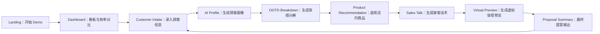

## 1. 产品概述
LookPilot AI Styling Workbench 是一个面向线下服装门店店员的 AI 导购效率化工作台，用于在接待顾客时将“顾客画像 → 穿搭分解 → 店内商品推荐 → 话术生成 → 虚拟预览 → 最终提案”流程从约 15 分钟压缩到约 3 分钟。
- 目标用户：门店导购（新人/资深）、店长（关注效率指标与转化）
- 产品价值：标准化搭配提案流程、降低新人上手门槛、提升交叉销售与推荐转化

## 2. 核心功能

### 2.1 功能模块
1. **Landing / 项目介绍**：项目价值说明、价值标签、进入 Demo 的 CTA
2. **Dashboard / 门店效率看板**：关键效率指标、Before/After 对比、进入提案流程入口
3. **Customer Intake / 顾客信息录入**：结构化表单、实时摘要卡片、生成 AI 顾客画像
4. **AI Customer Profile / AI 顾客画像**：结构化画像卡片、生成 OOTD 分解
5. **OOTD Breakdown / 穿搭分解图（核心视觉）**：中心人物 + 周边单品卡片 + 连接线、单品可点击进入推荐
6. **Product Recommendation / 店内商品推荐**：按品类推荐 3 件、选择加入 Selected Outfit、实时总价与匹配分
7. **Sales Talk / 接客话术生成**：多话术类型切换、一键复制、新人提示
8. **Virtual Preview / 虚拟穿搭预览**：生成加载、最终成果面板（占位图/风格化插画）、CTA（发送/加入购物车/保存）
9. **Proposal Summary / 最终提案结果**：闭环汇总（画像、选品、理由、最终话术、替代建议、效率指标）、导出/保存/下一位顾客
10. **顶部进度导航**：8 步进度条/导航可点击切换、当前步骤高亮

### 2.2 页面详细说明
| 页面名称 | 模块名称 | 功能描述 |
|---|---|---|
| Landing | Hero 区域 | 项目名称、副标题、中文说明、价值标签、CTA「开始 Demo」 |
| Dashboard | 指标卡片 | 展示：接客人数/已生成方案/平均提案时间/传统时间/节省时间/转化率/热门品类 |
| Dashboard | Before/After | 明确对比传统流程与 LookPilot 流程的时间与步骤变化 |
| Customer Intake | 表单 | 高度、体型、年龄段、当前风格、场景、预算、版型、喜欢/不喜欢颜色 |
| Customer Intake | 实时摘要 | 右侧 Summary 卡片随表单实时更新 |
| AI Profile | 画像卡片 | 风格定位、体型与版型建议、推荐颜色、推荐品类、避免事项、推荐理由摘要 |
| OOTD Breakdown | OOTD 画布 | 中心人物卡片 + 6 个单品卡片（Hat/Jacket/Innerwear/Pants/Shoes/Bag）+ 连接线 |
| Product Rec | 商品列表 | 每类 3 件商品卡片（图、尺码、价格、库存、匹配分、理由、选择按钮） |
| Product Rec | Selected Outfit | 右侧已选清单、总价、整体匹配分、自动生成对应话术摘要 |
| Sales Talk | 话术切换 | 标准/简短/Upsell/犹豫应对/尺码建议，多标签切换与复制 |
| Virtual Preview | 预览面板 | 风格名、匹配分、购买信心、总价、摘要文案、预览插画/占位图、CTA |
| Proposal Summary | 提案汇总 | 画像摘要、推荐风格、选品清单与理由、最终话术、替代建议、下次建议、效率指标 |
| 全局 | 顶部进度导航 | 8 步导航可点击切换，支持返回修改，当前步骤高亮与进度显示 |

## 3. 核心流程
店员从效率看板进入提案流程：录入顾客信息 → 一键生成画像 → 一键生成 OOTD 分解 → 点击单品品类进入商品推荐 → 选择商品形成 Outfit → 自动生成并优化话术 → 生成虚拟预览 → 输出最终提案摘要，可保存/导出/开启下一位顾客。

## 4. 用户界面设计

### 4.1 设计风格
- 整体基调：高质感 AI SaaS Dashboard + Fashion Retail 视觉语言
- 主题：高级深色/中性底色（墨蓝、石墨灰）+ 蓝紫/银色/米色/浅金点缀
- 卡片：Glassmorphism 玻璃拟态、圆角、柔和阴影、细边框与噪点质感
- 字体层级：大标题适合路演；关键指标数字大而克制；正文清晰可读
- 动效：卡片入场轻微上浮/淡入、加载状态与进度条、按钮点击反馈

### 4.2 页面设计概览
| 页面名称 | 模块名称 | UI 元素 |
|---|---|---|
| Landing | Hero | 大标题、渐变光晕背景、价值标签胶囊、玻璃 CTA |
| Dashboard | 指标卡 | 大数字、趋势/标签、Before/After 对比双栏卡片 |
| Customer Intake | 表单 + Summary | 左表单右摘要的双栏布局，输入即时反馈与校验提示 |
| AI Profile | 画像卡片 | 6 张卡片网格排布，关键字高亮与标签化 |
| OOTD Breakdown | 视觉画布 | 中心人物卡 + 周边单品卡 + 曲线/虚线连接、悬浮高亮、点击进入推荐 |
| Product Rec | 商品卡 + 已选清单 | 左商品瀑布/网格，右固定侧栏清单，选中高亮与总价实时跳动 |
| Sales Talk | 话术面板 | 话术类型 tabs、复制按钮、提示条「新人也能专业推荐」 |
| Virtual Preview | 成果面板 | 人物插画占位、评分环形进度、摘要文案、CTA 按钮组 |
| Proposal Summary | 汇总 | 信息分区卡片、导出/保存按钮组、效率指标突出展示 |

### 4.3 响应式与设备适配
- 桌面与平板优先（横向空间充足的双栏布局）
- 触控友好：按钮与可点击卡片的可点击区域 ≥ 44px，高对比的 hover/active 状态
- 小屏降级：侧栏可折叠为抽屉（Drawer）或底部面板

