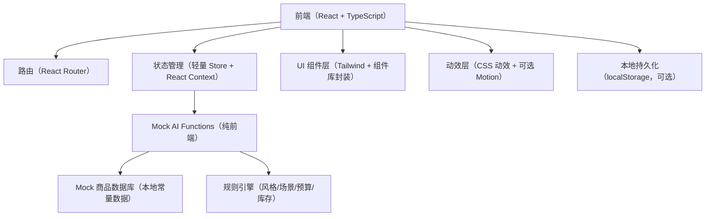

## 1. 架构设计

## 2. 技术说明
- 前端：React@18 + TypeScript + Vite
- 样式：Tailwind CSS（含自定义主题变量、玻璃拟态组件样式）
- 路由：react-router-dom（页面级切换）
- 图标：lucide-react（轻量、适合 SaaS）
- 动效：优先 CSS transition/animation；如需要更顺滑的页面过渡可引入 framer-motion
- 数据：Mock 数据（不接入真实后端/数据库/AI API）

## 3. 路由定义
| 路由 | 用途 |
|---|---|
| / | Landing：项目介绍与开始 Demo |
| /app/dashboard | Dashboard：门店效率看板 |
| /app/intake | Customer Intake：顾客信息录入 |
| /app/profile | AI Profile：AI 顾客画像 |
| /app/ootd | OOTD Breakdown：穿搭分解图 |
| /app/recommend | Product Recommendation：店内商品推荐 |
| /app/talk | Sales Talk：接客话术生成 |
| /app/preview | Virtual Preview：虚拟穿搭预览 |
| /app/summary | Proposal Summary：最终提案输出 |

## 4. 数据模型（前端类型）
核心类型将集中放在 `src/types/`，并在 Mock AI 与页面间复用：
- CustomerProfile
- Product
- OOTDItem
- SelectedOutfit
- SalesTalk
- EfficiencyMetric

## 5. Mock AI 设计（前端纯函数）
放置在 `src/mock-ai/`，以纯函数形式生成固定但合理的结果，并模拟异步延迟（Promise + setTimeout），用于展示加载状态与进度条：
- generateCustomerProfile(customerInput)
- generateOOTDBreakdown(customerProfile)
- recommendProducts(category, customerProfile)
- generateSalesTalk(selectedProducts, customerProfile, talkType)
- generateVirtualOutfitPreview(selectedProducts)
- calculateEfficiencyImpact()

推荐规则（示例）：
- Workwear：优先 Jacket / Wide Pants / Sneakers
- Office：优先 Blazer / Shirt / Slacks / Loafers（用于可扩展）
- Casual：优先 Hoodie / Denim / Sneakers（用于可扩展）
- Relaxed 版型：优先宽松款；Slim 版型：优先修身款（可扩展）
- 预算较低：优先价格更低商品
- 库存：Out of Stock 不推荐；Low Stock 标注提示

## 6. 目录结构建议
- src/
  - app/（全局布局、导航、主题）
  - pages/（页面组件）
  - components/（可复用 UI 组件：卡片、按钮、进度条、标签、侧栏等）
  - mock-ai/（Mock AI 与规则）
  - mock-data/（商品库、默认画像、文案模板）
  - types/（TypeScript 类型）
  - utils/（格式化、评分/价格计算等）

